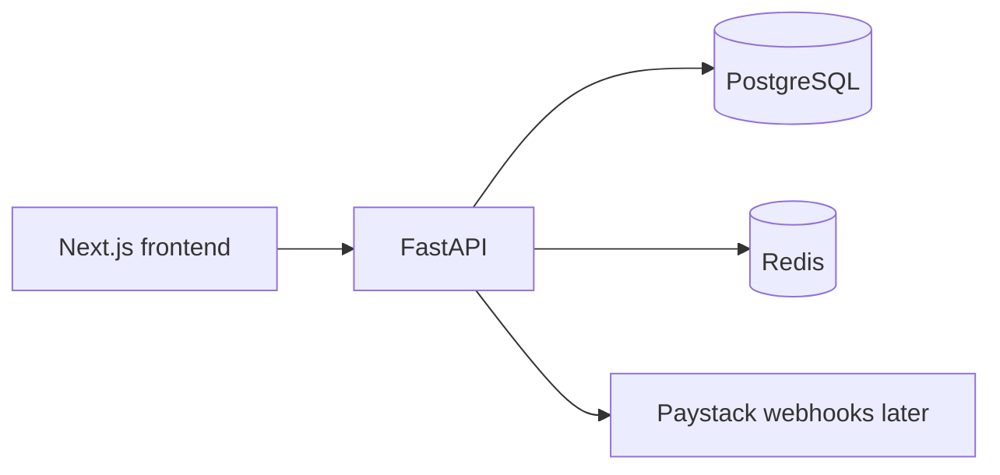

# Architecture

## Overview

Pàdéyá is a modular full-stack platform:

| Layer | Choice |
| --- | --- |
| Frontend | Next.js App Router, TypeScript, Tailwind CSS |
| Backend | FastAPI |
| Database | PostgreSQL |
| ORM / migrations | SQLAlchemy + Alembic |
| Cache / jobs | Redis |
| Local orchestration | Docker Compose |
| Payments (later) | Paystack |
| Auth (later) | JWT access + refresh tokens |

## High-level flow

## Backend modules

Domain packages under `backend/app/`:

- `core` — config, database, redis
- `auth`, `users`, `hosts`, `events`, `tickets`
- `payments`, `checkins`, `reviews`, `legacy`, `vault`
- `crm`, `support`, `admin`, `analytics`, `finance`

Each domain owns its router (and later models/services). Keep modules small and avoid cross-domain god objects.

## Frontend surfaces

- Public: `/`, `/events`, `/hosts`, marketing/support shells
- Auth shells: `/login`, `/register`
- Product shells: `/dashboard`, `/host`, `/admin`

Brand tokens and reusable UI live in `frontend/src/lib/brand.ts` and `frontend/src/components/ui/`.

## Non-goals (foundation phase)

- No auth implementation
- No events/tickets/payments business logic
- No Legacy Page / Vault / AI features
- No rebuild of the previous marketing site

## Operational principles

- Secrets only via environment variables
- Tickets issued only after verified payment webhooks
- Signed QR payloads for check-in
- Audit logs for admin and finance actions
- Manual payouts require immutable evidence
