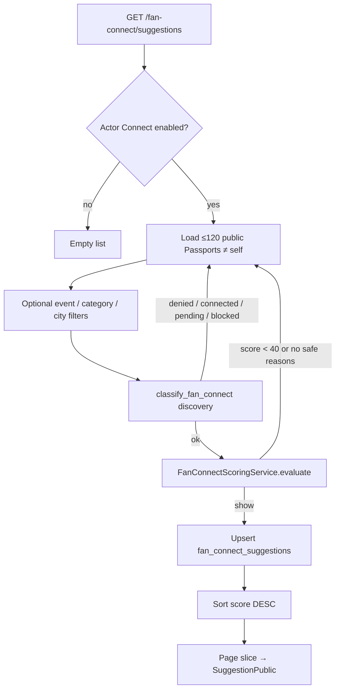

# Fan Connect suggestion algorithm — audit & upgrade plan

**Product:** Pàdéyá  
**Scope:** Audit only — do **not** treat this doc as an implementation ticket until phases are scheduled.  
**Date:** 2026-07-20  
**Status:** Upgrade implemented (scoring v2 + safe geo + dismiss/feedback + diversity mixer) — 2026-07-20.

---

## 1. Current algorithm summary

Fan Connect suggestions are generated **live on every** `GET /api/v1/fan-connect/suggestions` (and event-scoped `GET /api/v1/events/{slug}/fan-connect`).

High-level flow:

1. Require actor has Fan Connect enabled and a Passport username.
2. Load up to **120** public, non-admin-hidden Passports excluding self (**no** `ORDER BY`).
3. Optionally filter by `event_id` / `category` / `city` (API supports these; main FE suggestions page mostly uses `event` only).
4. For each candidate: run `classify_fan_connect(..., for_discovery=True)` then `FanConnectScoringService.evaluate`.
5. Keep only results with **score ≥ 40**, eligibility OK, and ≥1 **safe reason**.
6. Write-through upsert into `fan_connect_suggestions` (24h expiry) — **cache is not read when serving**.
7. Sort by score descending; paginate in memory (`limit`/`page`/`cursor`).

There is **no randomization**, **no dismissal history**, and **no GPS / nearby lat-lng** in Fan Connect (city is ticket-inferred + opt-in display only).

---

## 2. Files involved

### Backend

| Path                                     | Role                                                                                 |
| ---------------------------------------- | ------------------------------------------------------------------------------------ |
| `backend/app/fan_connect/router.py`      | `GET /suggestions`; event-scoped via events router                                   |
| `backend/app/events/router.py`           | `GET /events/{slug}/fan-connect`                                                     |
| `backend/app/fan_connect/service.py`     | `suggestions`, `suggestions_for_event_slug`, `_upsert_suggested`, card serialization |
| `backend/app/fan_connect/scoring.py`     | `FanConnectScoringService`                                                           |
| `backend/app/fan_connect/constants.py`   | Weights, thresholds, safe reason codes                                               |
| `backend/app/fan_connect/eligibility.py` | `classify_fan_connect`                                                               |
| `backend/app/fan_connect/lifecycle.py`   | `can_suggest` / connection status gates                                              |
| `backend/app/fan_connect/context.py`     | Shared public context (tickets, hosts, categories)                                   |
| `backend/app/fan_connect/policies.py`    | Request policy vs shared context                                                     |
| `backend/app/fan_connect/models.py`      | Settings, connections, blocks, reports, suggestions cache                            |
| `backend/app/passport/privacy.py`        | Public-safe event / city helpers                                                     |
| `backend/app/users/constants.py`         | `fan_connect.use` on buyer + host roles                                              |

### Frontend

| Path                                                         | Role                                               |
| ------------------------------------------------------------ | -------------------------------------------------- |
| `frontend/src/app/connect/suggestions/page.tsx`              | Suggestions route                                  |
| `frontend/src/components/fan-connect/ConnectSuggestions.tsx` | List + empty state                                 |
| `frontend/src/components/fan-connect/FanConnectCard.tsx`     | Card, reasons, Connect CTA, impressions            |
| `frontend/src/components/fan-connect/ConnectHome.tsx`        | Partitions by reason codes                         |
| `frontend/src/components/events/EventFanConnectSection.tsx`  | Event detail preview (hidden for own-host owner)   |
| `frontend/src/lib/fan-connect-api.ts`                        | Client API (supports unused category/city filters) |
| `frontend/src/lib/analytics.ts`                              | Suggestion impression / click events               |

### Tests & docs

| Path                                                     | Role                          |
| -------------------------------------------------------- | ----------------------------- |
| `backend/tests/test_fan_connect_scoring.py`              | Weights / threshold           |
| `backend/tests/test_fan_connect_privacy_safety.py`       | Privacy + exclusion gates     |
| `backend/tests/test_fan_connect.py`                      | Self / decline cooldown       |
| `backend/tests/test_fan_connect_demo_seed.py`            | Seed personas                 |
| `frontend/scripts/fan-connect-smoke.mjs`                 | Route smoke (not algorithm)   |
| `docs/FAN_CONNECT.md`                                    | Primary product/algorithm doc |
| `docs/API.md`, `docs/DATABASE.md`, `docs/CRUD_MATRIX.md` | API / tables / lifecycle      |

---

## 3. Current data used

| Signal                  | Data source                                                        | Notes                    |
| ----------------------- | ------------------------------------------------------------------ | ------------------------ |
| Shared upcoming event   | `tickets` status `active` + upcoming public-safe `events`          | Strongest signal         |
| Shared checked-in       | `tickets` status `checked_in` ∩ public-safe events                 | Past overlap             |
| Shared followed hosts   | `host_followers` intersection                                      | Cap on points            |
| Shared categories       | Passport `favorite_categories`                                     | Cap on points            |
| Shared public city      | Cities inferred from public-safe tickets + dual `show_public_city` | **Not** GPS              |
| Shared badges           | Public badges when both allow                                      | Soft affinity            |
| Recent activity         | Passport `updated_at` or recent tickets (30d)                      | Soft boost               |
| Mutual connection       | Shared `STATUS_CONNECTED` neighbors                                | Graph signal             |
| Declines / spam / trust | Connection decline cooldown; outgoing request count; account age   | Penalties                |
| Reports                 | Fan Connect + messaging reports                                    | Soft −30 or hard exclude |

**Not used today:** browser geolocation, mutual “dismiss”, review quality, Passport completeness score as a first-class weight (beyond badges/city toggles), diversity re-ranking, suggestion impression feedback into ranking.

---

## 4. Current filters / eligibility rules

### Hard rules (correct invariants — keep)

- Never suggest **self**.
- Never suggest **blocked** users (Fan Connect blocks **or** messaging blocks, either direction).
- Never suggest **accepted** or **pending** (`request_sent` / `request_received`) connections.
- Respect **decline cooldown** (14 days) before re-suggest / re-request.
- Target must be **active**, not messaging-suspended, Connect enabled, allow requests, policy not `nobody`.
- Target Passport must be **public**, have username, not admin-hidden.
- Discovery requires `discoverable_for_same_events` **OR** `discoverable_for_similar_interests`.
- Shared context must be **public-safe** (no private/secret/invite-only attendance leakage).
- Safe reason codes only (no VIP spend, private venue, payment, phone/email).
- Event-scoped lists require both sides to “know” the event via ticket (checked-in or active upcoming).

### Soft / scoring gates

- Score ≥ **40** and ≥1 safe reason.
- Soft report risk (−30); serious reports hard-exclude.
- New accounts (−15); too many outgoing requests (−25); recent decline (−40).

### Current score weights (as implemented)

| Signal                         | Points                                 |
| ------------------------------ | -------------------------------------- |
| Shared upcoming public event   | +35                                    |
| Extra “both ticketed upcoming” | +20 (effectively stacks with upcoming) |
| Shared checked-in public event | +15                                    |
| Shared host follow             | +12 each, max +24                      |
| Shared category                | +8 each, max +24                       |
| Shared public city             | +10                                    |
| Shared public badge            | +6 each, max +18                       |
| Both recently active           | +8                                     |
| Mutual accepted connection     | +10                                    |
| Recently declined              | −40                                    |
| ≥5 outgoing requests           | −25                                    |
| New account (<7d)              | −15                                    |
| Open report risk               | −30                                    |

Clamp **0–100**. Labels: Strong (≥80) / Good (≥60) / Similar (≥40).

---

## 5. Weaknesses and risks

### Product / ranking

1. **Candidate pool is tiny and unordered** (`LIMIT 120` with no order) → better matches can be invisible; results can feel arbitrary across refreshes.
2. **No diversity** → top of list can be monoculture (same scene/city).
3. **No “not interested” / dismiss** → users cannot train the feed; dismissed people reappear after cooldown gaps.
4. **Discoverability flags are OR’d only** → cannot honor “same events only” vs “interests only” as distinct modalities.
5. **Upcoming weight stacking** (+35 +20) overweight ticketed peers vs checked-in history.
6. **No location-aware nearby** when user explicitly allows geo (events nearby exists separately; Connect does not use it).
7. **Explainability is thin** → reasons are generic codes/labels; limited “You both attended X” with public event titles.

### Performance

1. **O(candidates × ticket/context queries)** per request — N+1 risk; will not scale with passport growth.
2. **Write-through cache never read** → wasted writes / DB churn; false sense of caching.
3. City filter can recompute favorites per candidate.

### Privacy / safety

1. **Public integer** `score` **on cards** may leak ranking internals (band/label may be enough).
2. Soft reports remain suggestable until keyword/threshold — intentional but should stay reviewable.
3. Own-host owners cannot ticket their own events → event-scoped empty for owners (correct privacy; document clearly). Host-as-fan on **other** events remains valid.

### Frontend gaps

1. No dismiss / refresh / filters (API already has category/city).
2. Empty state is generic.
3. Impression analytics exist but do not feed ranking.

### Test gaps

Pagination, candidate cap fairness, unused cache reads, category/city API filters, mutual-connection bonus, host-as-fan suggestion paths, and dismiss (when added) lack dedicated tests.

---

## 6. Proposed new scoring model (industry-standard weighted)

Keep hard exclusions. Replace live ad-hoc ranking with a clearer **weighted score + diversity mixer**.

### Proposed weights (target)

| Signal                               | Score       | Notes                                                                    |
| ------------------------------------ | ----------- | ------------------------------------------------------------------------ |
| Shared upcoming public event         | **+40**     | Cap count contribution (e.g. first event +40, diminishing)               |
| Checked in to same past public event | **+25**     | Verified attendance                                                      |
| Shared category / interest           | **+15**     | Passport favorites ∩                                                     |
| Same city/area (opt-in visibility)   | **+10**     | Prefer explicit user city when allowed; else ticket-inferred public city |
| Mutual connection                    | **+10**     | Shared accepted neighbors                                                |
| Followed host in common              | **+10**     | Cap total                                                                |
| Complete public Passport             | **+5**      | Username, avatar, bio/tagline, ≥1 category, city opt-in consistent       |
| Recent activity (30d)                | **+5**      | Soft                                                                     |
| Dismissed before                     | **−30**     | New dismissal history                                                    |
| Reported / blocked / privacy fail    | **Exclude** | Never score                                                              |

Remove or merge the current “+20 both ticketed upcoming” stack into the single upcoming weight to avoid double-counting.

Optional later: verified reviews overlap, trust tier, response-rate — only with privacy review.

### Diversity mixer (post-score)

After scoring, build the page from buckets (not pure top-N):

1. **Strong matches** (score ≥ 80)
2. **Event-based** (shared upcoming / checked-in)
3. **Nearby / same city** (opt-in)
4. **Fresh / under-shown** profiles (low impression count, new Passport)

Target mix per page of 12: e.g. 4 strong · 3 event · 3 city/interest · 2 fresh. Deduplicate. Never fill with excluded users.

### Explainability

Each card should include 1–2 human reasons, e.g.:

- “You both have tickets to **Afrobeat Night Live**”
- “You both checked in at **Island Sessions**”
- “You both follow **Host Name**”
- “Similar interests: Afrobeat, Nightlife”

Only use **public** event titles / host display names / categories the viewer is allowed to know.

---

## 7. Database / API changes needed

### Database

| Change                                                                                                                        | Purpose                                         |
| ----------------------------------------------------------------------------------------------------------------------------- | ----------------------------------------------- |
| `fan_connect_suggestion_dismissals` (actor_id, target_id, dismissed_at, reason?)                                              | “Not interested”; apply −30 / temporary exclude |
| Optional `fan_connect_suggestion_impressions` (or rely on analytics warehouse)                                                | Under-shown / fatigue                           |
| Make `fan_connect_suggestions` a **real serving cache** *or* drop write-through until read path exists                        | Stop wasted writes                              |
| Indexes: public discoverable passport partial index; tickets `(buyer_user_id, status)`; dismissals `(actor_id, dismissed_at)` | Candidate + score perf                          |
| Optional materialized / nightly candidate graph edges (shared events, hosts)                                                  | Scale beyond 120                                |

### API

| Endpoint / field                                                    | Purpose                                                         |
| ------------------------------------------------------------------- | --------------------------------------------------------------- |
| Keep `GET /fan-connect/suggestions`                                 | Add `mode` / filters: `near_me`, `same_event`, `same_interests` |
| `POST /fan-connect/suggestions/{user_id}/dismiss`                   | Not interested                                                  |
| `POST /fan-connect/suggestions/refresh` (optional)                  | Explicit reshuffle within policy                                |
| Enrich `SuggestionPublic.reasons[].label`                           | Event-title explainability                                      |
| Consider hiding raw `score` from public (keep `score_band` / label) | Reduce ranking leak                                             |
| Admin `GET /admin/fan-connect/debug/score?actor=&target=`           | Inspect breakdown (permissioned)                                |

Env / config: feature flags for new scorer; weight constants remain centralized in `constants.py`.

---

## 8. Frontend changes needed

1. **Why this person** — primary reason with public event/host name; secondary chip list.
2. **Dismiss / Not interested** — card action; optimistic remove; undo toast optional.
3. **Refresh suggestions** — button with rate limit.
4. **Filters** — Near me (opt-in geo or city), Same event, Same interests (wire existing API params).
5. **Empty states** — Connect off vs no overlap vs all dismissed vs private event.
6. **Loading / error** — skeletons + retry (partially present; harden).
7. **Hub sections** — keep ConnectHome partitions but drive from richer reason metadata.
8. **Event section** — keep own-host hide; improve copy when empty because no ticket.

---

## 9. Privacy / safety rules (non-negotiable)

These remain product invariants for Pàdéyá:

1. Never suggest self.
2. Never suggest blocked users (Connect or messaging, either direction).
3. Never suggest accepted / pending connections.
4. Never suggest users who disabled Connect or discoverability (respect modality when flags are split).
5. Never leak private event attendance, undisclosed venues, private Passport fields, phone/email, payments, VIP spend.
6. Reasons and explainability must use **public-safe** events/hosts/categories only.
7. Host-as-fan remains valid for **other** hosts’ events; own-event peer discovery stays ticket-gated.
8. Do not store browser geolocation on the server for Connect unless the user explicitly saves a **city/area preference** with clear consent (prefer city taxonomy over precise lat/lng).
9. Serious reports continue to hard-exclude; soft risk may deprioritize but policy should stay auditable.
10. Admin debug scoring must be permissioned and audited.

---

## 10. Performance / index recommendations

**Short term**

- Stable candidate prefilter SQL (discoverable + public passport) with deterministic ordering (e.g. `updated_at DESC`) before scoring.
- Batch ticket/host/badge loads for the candidate set (avoid per-pair full context).
- Stop writing suggestion cache until a read path exists **or** serve from cache with score version key.
- Cap scoring work: score top-K after cheap filters (shared event/host/category existence).

**Indexes (priority)**

1. Partial index on public, non-hidden passports with username.
2. Ensure tickets indexed for `(buyer_user_id, status)` (+ event_id join).
3. Dismissals `(actor_user_id, target_user_id)` unique + `(actor_user_id, dismissed_at)`.
4. If cache is served: `(user_id, expires_at, score DESC)`.

**Medium term**

- Precomputed pairwise / edge tables refreshed async (shared upcoming events, shared hosts).
- Optional Redis cache of suggestion pages keyed by `(user_id, filter_hash, scorer_version)` with short TTL (5–15 min).

---

## 11. Test plan

### Keep / extend existing

- Self exclusion, blocks, private/unlisted events, discoverability off, requests off, decline cooldown, score threshold, unsafe fields absent.

### Add

| Area              | Cases                                                                  |
| ----------------- | ---------------------------------------------------------------------- |
| Scoring           | Upcoming +40, checked-in +25, dismiss −30, exclude on block/report     |
| Eligibility       | Same-events-only vs interests-only when flags are split                |
| Explainability    | Public event title present; private event title never appears          |
| Diversity         | Page mix includes non-identical buckets when pool allows               |
| Pagination        | Stable cursor; no duplicate IDs across pages                           |
| Performance smoke | Candidate batching does not N+1 (query count budget in tests optional) |
| Host-as-fan       | Owner excluded from own-event scoped list; can match on other events   |
| FE                | Dismiss removes card; filters call API; empty states; refresh          |
| Admin             | Debug score endpoint permission + breakdown                            |

---

## 12. Implementation phases

### Phase 0 — Small safe fixes (optional, only if scheduled)

- Document that `fan_connect_suggestions` is write-only today (done here).
- Stop unnecessary cache writes **or** add a feature flag to disable upsert (perf-only, behavior-preserving).
- Add deterministic `ORDER BY` on candidate passport query (fairness/stability) without changing weights.

*Do not expand scope in Phase 0.*

### Phase 1 — Ranking v2 (backend)

- Align weights to the proposed table; remove double-count upcoming bonus.
- Batch shared-signal loading.
- Add dismissal table + API; apply −30 / exclude window.
- Enrich reason labels with public event/host names.
- Admin debug score endpoint.

### Phase 2 — Diversity + filters

- Diversity mixer.
- Wire FE filters (near me via opt-in city / future geo preference, same event, interests).
- Impression → under-shown boost (privacy-safe aggregates).

### Phase 3 — Scale

- Precompute edges / serveable cache with versioning.
- Partial indexes + Redis page cache.
- Optional review/trust signals after privacy review.

### Phase 4 — Polish

- FE dismiss / refresh / richer empty states.
- Hide raw score if product agrees.
- Expand tests + update `docs/FAN_CONNECT.md` as source of truth after ship.

---

## Appendix A — Current vs proposed (quick compare)

| Dimension      | Current                 | Proposed                                            |
| -------------- | ----------------------- | --------------------------------------------------- |
| Serving        | Live score each request | Live or cached page with versioned scorer           |
| Pool           | 120 unordered passports | Filtered + ordered/precomputed candidates           |
| Ranking        | Pure score sort         | Score + diversity buckets                           |
| Dismiss        | None                    | First-class −30 / exclude                           |
| Location       | Ticket city opt-in only | Same + optional consented city preference           |
| Explainability | Generic reason labels   | Named public events/hosts                           |
| Cache table    | Write-only              | Serve or remove write path                          |
| GPS            | Not used                | Prefer city; GPS only with explicit consent if ever |

---

## Appendix B — Decision log (pre-implementation)

| Decision                  | Recommendation                                                        |
| ------------------------- | --------------------------------------------------------------------- |
| Implement now?            | **No** — audit first (this doc). Only Phase 0 if explicitly approved. |
| PostGIS for Connect?      | **No** for v1; reuse city/taxonomy; optional later.                   |
| Keep score integer on FE? | Prefer band/label; deprecate raw score carefully.                     |
| Host-as-fan               | Keep; do not special-case out of Personal Connect.                    |

---

*End of audit. Next step: product review of phases, then schedule Phase 0/1.*