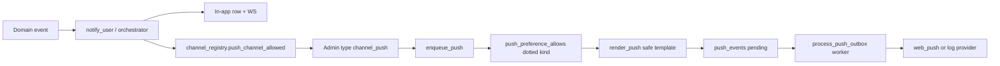

# Pàdéyá notification push audit

Brand: **Pàdéyá**. Last updated: 2026-07-22.

This document records user-facing notification kinds, channel support, preference/admin gating, privacy, and where each alert is triggered. Implementation sources:

- Channel registry: `backend/app/notifications/channel_registry.py`
- Push templates + aliases: `backend/app/push/templates.py`
- Dispatch: `notify_user()` → in-app + WS + `enqueue_push()` → `push_events` outbox
- Admin per-type channels: `backend/app/admin_notifications/registry.py` + `/admin/notifications/settings`
- Automated coverage: `backend/tests/test_notification_push_coverage.py`

## Architecture (push path)



Rules:

- One product event → one in-app row; push is a separate outbox row (dedupe `push:{dedupe_key}`).
- Email stays on `enqueue_template` in domain modules (unchanged).
- No production sends from tests; providers default to `log` in CI.

## Intentional no-push exceptions

| Kind | Reason |
|---|---|
| `admin.internal_note` | Internal CRM/admin notes (reserved; not wired to `notify_user`) |
| `crm.host_note` | Host CRM private notes (reserved) |

All other wired `notify_user` kinds allow push when global push, subscription, admin type, and user prefs permit.

Admin **custom campaigns** (`admin.campaign`, `admin.custom`) use the **generic** push template with admin-composed title/body — only for explicit broadcasts; ops must keep copy privacy-safe.

## Channel matrix (wired product kinds)

Legend: **I** = in-app, **E** = email (domain template), **P** = push (safe template). Prefs = user push category; Admin = `/admin/notifications/settings` type.

| Kind | I | E | P | Push template | User pref key | Trigger |
|---|---|---|---|---|---|---|
| `ticket.confirmed` | ✓ | ✓ | ✓ | `ticket_confirmed` | `push_ticket_updates` | `tickets/service.py` after verified payment |
| `ticket.qr_ready` | ✓ | optional | ✓ | `ticket_qr_ready` | `push_ticket_updates` | `notifications/triggers.py` |
| `ticket.event_reminder` | ✓ | ✓ | ✓ | `ticket_event_reminder` | `push_event_reminders` | jobs / admin orchestrator |
| `ticket.event_cancelled` | ✓ | ✓ | ✓ | `ticket_event_cancelled` | `push_ticket_updates` | `events/service.py` |
| `event.updated` / `event.rescheduled` | ✓ | ✓ | ✓ | `ticket_event_updated` | `push_event_reminders` | orchestrator / future event notify |
| `ticket.refund_update` | ✓ | ✓ | ✓ | `ticket_refund_update` | `push_ticket_updates` | `notifications/triggers.py` |
| `ticket.transferred` | ✓ | ✓ | ✓ | `ticket_transferred` | `push_ticket_updates` | `tickets/service.py` |
| `ticket.transfer_accepted` | ✓ | ✓ | ✓ | `ticket_transfer_accepted` | `push_ticket_updates` | `tickets/service.py` |
| `ticket.checked_in` | ✓ | optional | ✓ | `ticket_checked_in` | `push_ticket_updates` | `checkins/service.py` QR/manual scan; `offline_service.py` sync; override when first transition |
| `merch.confirmed` / `merch.paid` | ✓ | ✓ | ✓ | `merch_order_confirmed` | `push_merch_updates` | `merch/notifications.py` |
| `merch.ready_for_pickup` | ✓ | ✓ | ✓ | `merch_pickup_ready` | `push_merch_updates` | `merch/notifications.py` |
| `merch.shipped` / `delivered` | ✓ | ✓ | ✓ | `merch_shipping_update` | `push_merch_updates` | `merch/notifications.py` |
| `merch.picked_up` | ✓ | ✓ | ✓ | `merch_picked_up` | `push_merch_updates` | `merch/notifications.py` |
| `merch.refunded` | ✓ | ✓ | ✓ | `merch_refund_update` | `push_merch_updates` | `merch/notifications.py` |
| `merch.post_event_drop` | ✓ | ✓ | ✓ | `post_event_drop_available` | `push_marketing` | `merch/notifications.py` |
| `merch.cart_reminder` | ✓ | ✓ | ✓ | `merch_cart_reminder` | `push_marketing` | `merch/notifications.py` |
| `merch.vault_unlocked` | ✓ | ✓ | ✓ | `merch_vault_unlocked` | `push_merch_updates` | `merch/notifications.py` |
| `vault.item_published` | ✓ | optional | ✓ | `vault_item_published` | `push_marketing` | admin orchestrator |
| `merch.host_sale` | ✓ | ✓ | ✓ | `merch_host_sale` | `push_host_activity` | `merch/notifications.py` |
| `merch.host_pickup` / `sold_out` / `low_stock` / `host_cart_summary` | ✓ | partial | ✓ | host merch templates | `push_host_activity` | `merch/notifications.py` |
| `merch.badge_earned` | ✓ | — | ✓ | `merch_badge_earned` | `push_merch_updates` | `merch/notifications.py` |
| `host.ticket_sale` | ✓ | ✓ | ✓ | `host_ticket_sale` | `push_host_activity` | `tickets/service.py` |
| `host.new_follower` | ✓ | ✓ | ✓ | `host_new_follower` | `push_host_activity` | `crm/service.py` |
| `review.new` / `review.reply` | ✓ | ✓ | ✓ | `host_new_review` | `push_reviews` | `reviews/service.py` |
| `message.*` / `fan_connect.message` | ✓ | away | away | `new_message` / `fan_connect_message` | `push_messages` | `messaging/notifications.py` |
| `fan_connect.request` / `accepted` / `declined` / `removed` | ✓ | ✓ | ✓ | fan_connect_* | `push_fan_connect` | `fan_connect/notifications.py` |
| `sponsor.inquiry_*` | ✓ | ✓ | ✓ | sponsor_* | `push_sponsor_updates` / host | `sponsorships/service.py` |
| `support.ticket_updated` | ✓ | ✓ | ✓ | `support_ticket_updated` | `push_ticket_updates` | `support/notifications.py` |
| `admin_support_ticket` | ✓ | admin | ✓ | `admin_support_ticket` | `push_host_activity` | `support/notifications.py` (staff) |
| `admin.report` / payment | ✓ | admin | ✓ | `admin_*` | `push_host_activity` | `notifications/triggers.py` |
| `account.suspended` / `account.appeal_decision` | ✓ | ✓ | ✓ | account_* | `push_security` | `appeals/suspension_notify.py` |
| `system.maintenance` | ✓ | ✓ | ✓ | `system_maintenance` | `push_security` | `maintenance/notify.py` |
| `team.*` | ✓ | ✓ | ✓ | `team_*` | `push_host_activity` / security | `teams/notify.py` |
| Ambassador kinds | ✓ | ✓ | ✓ | `ambassador_*` | `push_ticket_updates` | `ambassadors/notifications.py` |

Messaging push/email only when recipient is **away** (not active on thread / not present) — in-app always.

## Privacy-safe push payloads

Enforced in `push/privacy.py`, `PushPayload.to_json()`, and `public/sw.js` whitelist.

Never in push title/body/data:

- QR payloads, ticket secrets, raw ticket/order/payment IDs, Paystack refs
- Private venue/shipping addresses, Vault content, full chat bodies
- Phone, email, PII, admin internal notes, fraud reasons

Support and security templates use fixed copy; details only behind authenticated `action_url` / deep links.

## User preferences

- Master: `push_enabled` (required for any push).
- Categories: see [NOTIFICATIONS.md](./NOTIFICATIONS.md#preference-keys).
- Security (`push_security`): allowed when master is on; not blocked by marketing unsubscribe.
- Non-critical categories honor explicit opt-out.
- Device: register via `POST /api/v1/push/subscriptions` after user clicks **Enable notifications** (no load-time permission prompt).

## Admin notification settings

Every type in `admin_notifications/registry.py` exposes in-app, email, and push toggles on `/admin/notifications/settings`. Types with `critical=True` require super-admin to disable.

Campaign orchestrator resolves push templates via `resolve_template_name(canonical)` (not naive dot→underscore).

## Test coverage

| Suite | What it checks |
|---|---|
| `test_notification_push_coverage.py` | Wired kinds map to non-generic templates; registry allows push; support/security copy; pref kind for `merch.host_sale` |
| `test_push_templates.py` | Template catalog |
| `test_push_privacy.py` | Sanitizer / payload whitelist |
| `test_push_checklist.py` | Subscribe, outbox, prefs, worker (log provider) |
| `test_checkin_notifications.py` | QR/manual check-in → `ticket.checked_in`; dedupe; guest skip; prefs/admin push off |
| `test_notifications_push.py` | `notify_user` + admin push settings |

Run (backend):

```bash
cd backend && python3 -m pytest tests/test_notification_push_coverage.py tests/test_notification_push_integration.py tests/test_checkin_notifications.py tests/test_push_templates.py tests/test_push_privacy.py tests/test_push_checklist.py tests/test_notifications_push.py -q
```

## Gaps / follow-ups

- **Gift claim link**: email/in-app paths exist in ticketing; ensure kind aliases if a dedicated in-app kind is added.

See also: [NOTIFICATIONS.md](./NOTIFICATIONS.md) · [PUSH_NOTIFICATIONS.md](./PUSH_NOTIFICATIONS.md) · [SECURITY.md](./SECURITY.md).
